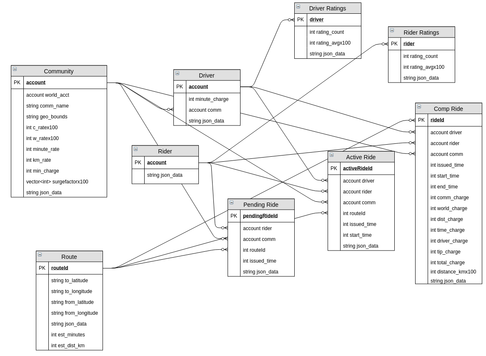

# Eva Training

## Stack
 - [Eva platform notes](https://hackmd.io/s/SyR2tOoyX)
 - Languages : {Python, C++, TypeScript, Git, SQL, CSS, bash}
 - Technologies : {EOSIO, Blockchain, SQLAlchemy, Flask, React-Native, XCode, Android Studio, Docker, Git}
 - Networking : {Client-API, Client-EOSNet, API-EOSNet}
 - Code deployment and agile board : Phabricator
 - Communication : Telegram EVA Developers


## EOS Tutorials
 - Go through the [Eos Wiki](https://github.com/EOSIO/eos/wiki) (tutorials at the end too)
 - Presentation of the EVA contract.


## React Native
 - Blank project [Link](https://medium.com/@filipvitas/setup-react-native-app-from-scratch-7f42cbeb4b01)
 - React Native Tutorials [Link](https://facebook.github.io/react-native/docs/tutorial.html)
 - Map React-Native app challenge
 - Presentation of the EVA client.

## Tutorail environment
### TUTORIAL EOS
```
docker-compose build
docker-compose up
```

Then you need to build and deploy abi
```
docker exec -it eos_tutorial_keosd_1 ./contracts-entrypoint.sh
```

Open container from within with bash

```
docker exec -ti eos_tutorial_nodeosd_1 /bin/sh

```

Alias cleos to run it
```
alias cleos='docker exec  eos_tutorial_nodeosd_1  cleos -u http://nodeosd:8888'
```


